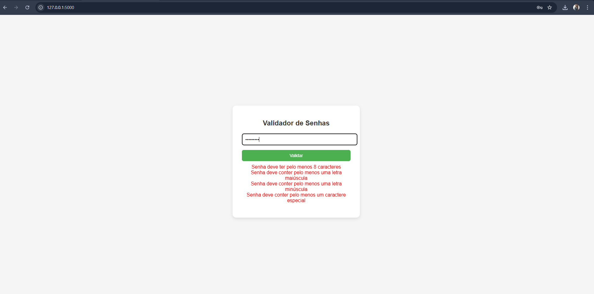

# 🔐 Validador de Senhas com Flask

## 📌 Descrição
Este projeto é uma aplicação web simples feita com **Python** e **Flask** que valida senhas de acordo com critérios básicos de segurança.

O sistema verifica se a senha possui:
- Pelo menos **8 caracteres**
- **Letra maiúscula**
- **Letra minúscula**
- **Número**
- **Caractere especial**

Caso a senha não atenda aos critérios, o sistema mostra quais regras não foram cumpridas.

> ⚠️ Observação: este projeto roda **localmente** na sua máquina. Não é necessário abrir portas ou expor sua rede.

---

## 🖼️ Screenshot da aplicação

> A imagem mostra a aplicação rodando no navegador, com um exemplo de senha válida ou inválida.

---

## 🚀 Tecnologias utilizadas
- Python  
- Flask  
- HTML  
- CSS  

---

## ▶️ Como executar o projeto (cmd)

   
 1. Clone o repositório:
git clone https://github.com/seuusuario/validador-de-senhas-flask.git

2. Entre na pasta do projeto:
cd validador-de-senhas-flask

3. Instale as dependências:
pip install flask

4. Execute a aplicação:
python app.py

5. Abra no navegador:
http://127.0.0.1:5000

🎯 Objetivo
Este projeto foi criado para praticar o desenvolvimento de aplicações web simples utilizando Flask.
